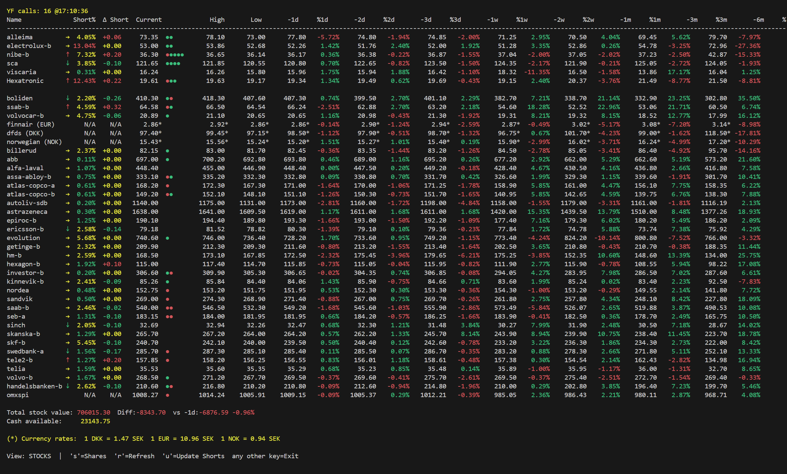

# yspy

A terminal-based stock portfolio management application featuring real-time price monitoring, comprehensive historical data analysis, and an intuitive ncurses interface.


[](https://github.com/H4jen/yspy)

## 📺 Watch Screen Demo



*Real-time portfolio monitoring with live price updates, historical data, and color-coded performance indicators*

> ⚠️ **Alpha Release**: This project is in active development. Features and APIs may change. Use at your own risk and always backup your portfolio data.
>
> ⚠️ **AI Privacy Notice**: The optional AI assistant sends portfolio data to cloud services (Anthropic/OpenAI/Google). Do not enable if you're uncomfortable sharing financial data with third parties. See AI section for details.

---

## 🚀 Quick Installation

### For Impatient Users (3 commands)

```bash
git clone https://github.com/H4jen/yspy.git
cd yspy
pip install -r requirements.txt
./yspy.py
```

### Recommended Installation (with virtual environment)

```bash
# 1. Clone the repository
git clone https://github.com/H4jen/yspy.git
cd yspy

# 2. Create virtual environment
python3 -m venv venv
source venv/bin/activate  # On Linux/macOS
# venv\Scripts\activate   # On Windows

# 3. Install dependencies
pip install -r requirements.txt

# 4. Run yspy
./yspy.py

# Optional: Enable AI Assistant (see AI section below)
# pip install anthropic && export YSPY_AI_API_KEY='your-key'
```

**Windows Users**: Install `windows-curses` with `pip install windows-curses`

> 💡 **Note**: The AI assistant is optional and requires separate setup (API key + AI library). All other features work out of the box!
> 
> ⚠️ **AI Privacy Warning**: If you enable the AI assistant, your portfolio data will be sent to cloud AI services (Anthropic, OpenAI, or Google). See the AI section below for full privacy implications.

---

## 🆕 Recent Updates (October 2025)

### AI-Powered Assistant 🤖 NEW!
- **Natural Language Analysis**: Ask questions about your portfolio in plain English
- **Multi-Provider Support**: Choose between Claude, GPT, or Gemini
- **10 Built-in Tools**: Portfolio analysis, web search, report downloads, and more
- **Privacy Controls**: Optional data anonymization and local storage
- **Cost Management**: Daily spending limits and response caching
- **Smart Integration**: Context-aware responses using your actual portfolio data
- ⚠️ **Privacy Note**: Sends portfolio data to cloud AI services - see AI section for details

### Project Restructuring ✨
- **Professional Layout**: Reorganized codebase into logical modules (`src/`, `short_selling/`, `ai_gui/`, `tests/`, `docs/`)
- **Better Organization**: Separated concerns with clear module boundaries
- **Improved Maintainability**: Easier navigation and cleaner import structure
- **Documentation**: Comprehensive docs organized by category in `docs/` directory

### Bug Fixes & Improvements 🔧
- **Fixed Short Selling Display**: Resolved import issues causing short % and trend arrows to not display
- **Portfolio Loading**: Fixed path resolution after restructuring (auto-detects project root)
- **Import Updates**: All 17+ files updated to use correct module paths
- **Data Organization**: Generated data moved to `data/` directory for cleaner workspace

---

## 📘 Understanding the Basics

### What Are Stocks, Shares, and Tickers?

**Stocks** represent ownership in a company. When you buy stock, you become a partial owner of that business.

**Shares** are the individual units of stock. If you buy 100 shares of Apple, you own 100 units of Apple stock.

**Ticker Symbols** (or just "tickers") are unique abbreviations used to identify publicly traded companies:
- `AAPL` = Apple Inc.
- `MSFT` = Microsoft Corporation
- `VOLV-B.ST` = Volvo B shares on Stockholm Stock Exchange

Different stock exchanges use different ticker formats:
- **US stocks**: Simple letters (e.g., `TSLA`, `GOOGL`)
- **European stocks**: Often include exchange suffix (e.g., `.ST` for Stockholm, `.L` for London)

### Data Source: Yahoo Finance

This application relies on **Yahoo Finance** as its data provider, accessed through the **yfinance** Python library.

**What is Yahoo Finance?**
- One of the world's largest free financial data providers
- Offers real-time and historical stock prices
- Covers global stock exchanges
- Provides company information, financial data, and market statistics

**Why yfinance?**
- ✅ **Free to use** - No API keys or subscriptions required
- ✅ **Global coverage** - Access to stocks from major exchanges worldwide
- ✅ **Comprehensive data** - Real-time prices, historical data, company info
- ✅ **Well-maintained** - Active community and regular updates
- ✅ **Easy to use** - Simple Python interface

**Important Limitations:**
- ⚠️ **Not official** - yfinance uses Yahoo Finance's public interface (not an official API)
- ⚠️ **No guarantees** - Yahoo can change their system at any time
- ⚠️ **Rate limiting** - Too many requests may result in temporary blocks
- ⚠️ **Data accuracy** - While generally reliable, always verify critical financial decisions
- ⚠️ **Delayed data** - Some exchanges may have 15-20 minute delays for free data

**For Production/Commercial Use:**
If you need guaranteed uptime and data accuracy, consider paid alternatives:
- Alpha Vantage
- IEX Cloud
- Polygon.io
- Official exchange APIs

This application is designed for **personal portfolio tracking and educational purposes**.

## ✨ Features

### Core Functionality
- 📈 **Real-time Stock Monitoring** - Live price updates with configurable auto-refresh intervals
- 💼 **Portfolio Management** - Complete transaction tracking with buy/sell operations
- 📊 **Historical Analysis** - Multi-timeframe data (1 day to 1 year) with percentage changes
- � **Capital Tracking** - Time-weighted returns and cash flow management with deposits/withdrawals
- �🔗 **Correlation Analysis** - Statistical analysis and visualization of stock relationships
- 💱 **Multi-Currency Support** - Automatic conversion with live exchange rates (SEK default)

### Advanced Capabilities
- 🔄 **Automated Background Updates** - Continuous historical data refresh without blocking UI
- ✅ **Individual Ticker Validation** - Isolated error handling prevents cascade failures
- 🛡️ **Data Quality Assurance** - Automatic detection and correction of data anomalies
- 🔁 **Intelligent Fallback System** - Preserves working data when APIs fail
- ⚡ **Performance Optimized** - Thread-safe operations with efficient caching
- 📉 **Short Selling Analysis** - Track short positions with historical trends and holder information
- 🌐 **Remote Data Integration** - Fetch data from remote servers via multiple protocols (SSH, HTTP, S3, NFS)
- 🤖 **AI-Powered Assistant** - Natural language portfolio analysis with Claude, GPT, or Gemini integration

### User Experience
- 🖥️ **Full-screen Terminal UI** - Professional ncurses interface with scrolling support
- 🎨 **Color-Coded Display** - Intuitive green/red indicators for price movements
- 👁️ **Multiple View Modes** - Toggle between portfolio overview and detailed holdings
- 🚀 **Non-blocking Operations** - Smooth, responsive interface during data updates

## 🚀 Quick Start

> **⚠️ Alpha Software Notice**: This application is under active development. While functional, it may contain bugs and undergo significant changes. Please backup your portfolio data regularly.

### Prerequisites
- Python 3.7 or higher
- Terminal with color support
- Internet connection for API access

### Installation

**1. Clone the repository**
```bash
git clone https://github.com/H4jen/yspy.git
cd yspy
```

**2. Set up virtual environment (recommended)**
```bash
python3 -m venv venv
source venv/bin/activate  # On Linux/macOS
# venv\Scripts\activate   # On Windows
```

**3. Install dependencies**
```bash
pip install -r requirements.txt
```

> **Note for Windows users**: You'll need to install `windows-curses`:
> ```bash
> pip install windows-curses
> ```

**4. Launch the application**
```bash
python3 yspy.py
```

### Quick Install (Without Virtual Environment)
```bash
pip install -r requirements.txt
python3 yspy.py
```

## 📖 Usage

### Main Menu Commands
| Command | Function | Description |
|---------|----------|-------------|
| `1` | List Stocks | View all stocks in your portfolio |
| `2` | Add Stock | Add a new stock by ticker symbol |
| `3` | Remove Stock | Remove a stock from portfolio |
| `4` | List Shares | View detailed share holdings and transactions |
| `5` | Buy Shares | Purchase shares with automatic price tracking |
| `6` | Sell Shares | Sell shares with profit/loss calculation |
| `7` | Watch Stocks | Real-time monitoring mode (10-second refresh) |
| `8` | Profit per Stock | Individual stock performance analysis |
| `9` | All Profits | Portfolio-wide profit summary |
| `a` | Capital Management | Track deposits/withdrawals and calculate time-weighted returns |
| `s` | Short Selling Analysis | Track short positions and trends (Swedish/Finnish stocks) |
| `c` | Correlation Analysis | Statistical analysis and visualization |
| `q` | Quit | Exit the application |

### AI Assistant 🤖
When an API key is configured, the AI assistant launches automatically in a **separate GUI window** alongside the main application:
- No menu selection needed - opens automatically at startup
- Modern chat interface runs in its own graphical window (Tkinter)
- Ask questions while the main terminal portfolio app continues running
- Status shown in main menu: "🤖 AI Assistant: Running in separate window"

### Watch Mode Features
- **Live Updates**: Automatic price refresh every 10 seconds
- **Price History**: 6-dot color-coded change indicator
- **Multi-Timeframe**: 1d, 2d, 3d, 1w, 2w, 1m, 3m, 6m, 1y percentage changes
- **View Toggle**: Switch between portfolio overview and detailed shares view
- **Color Coding**: Green for gains, red for losses
- **Portfolio Stats**: Total value, overall performance, and market status

## 🏗️ Architecture

### Project Structure

```
yspy/
├── 📱 Entry Point
│   └── yspy.py                     # Application entry point (main executable)
│
├── 💻 Core Application (src/)
│   ├── yspy_app.py                 # Main application logic & menu system
│   ├── app_config.py               # Configuration management
│   ├── portfolio_manager.py        # Portfolio management engine
│   ├── menu_handlers.py            # Command handlers (add/remove/watch stocks)
│   ├── ui_handlers.py              # UI event handlers & base classes
│   ├── correlation_analysis.py     # Statistical analysis tools
│   ├── update_historical_prices.py # Historical data management
│   └── historical_portfolio_value.py # Portfolio value tracking
│
├── 🎨 User Interface (ui/)
│   ├── display_utils.py            # Display utilities and formatting
│   ├── stock_display.py            # Stock visualization components
│   └── profit_utils.py             # Profit display calculations
│
├── � Short Selling Module (short_selling/)
│   ├── short_selling_integration.py # Short selling data integration
│   ├── short_selling_tracker.py     # Position tracking & data fetching
│   ├── short_selling_menu.py        # Short selling UI and trend analysis
│   ├── remote_short_data.py         # Remote data fetching (SSH/HTTP/S3/NFS)
│   └── nordic_isin_mapping.py       # ISIN mapping for Nordic stocks
│
├── 🤖 AI Assistant (ai_gui/, ai_agent/)
│   ├── ai_chat_window.py            # Chat interface
│   ├── ai_menu_handler.py           # AI assistant menu integration
│   ├── agent.py                     # AI agent core logic
│   ├── cloud_provider.py            # Multi-provider AI support
│   ├── cache.py                     # Response caching
│   └── tools.py                     # AI tool functions
│
├── ⚙️ Configuration (config/)
│   ├── ai_config.py                 # AI assistant configuration
│   └── remote_config.json           # Remote data source configuration
│
├── 🌐 Remote Setup (remote_setup/)
│   ├── setup_remote_shorts.sh       # Interactive setup wizard
│   ├── update_shorts_cron.py        # Server cron script for data collection
│   └── *.md                         # Setup documentation
│
├── 💾 Data Directories
│   ├── portfolio/                   # User portfolio data (JSON files)
│   │   ├── stockPortfolio.json     # Stock holdings
│   │   ├── profit_tracker.json     # Profit/loss data
│   │   ├── historical_prices.json  # Cached price data
│   │   └── *.json                  # Per-stock profit tracking
│   ├── data/                        # Application generated data
│   │   ├── ai/                     # AI assistant data
│   │   └── downloads/              # Downloaded files
│
├── 🧪 Tests (tests/)
│   └── *.py                         # Unit tests
│
├── 📚 Documentation (docs/)
│   ├── ai/                          # AI implementation docs
│   ├── implementation/              # Technical implementation docs
│   └── proposals/                   # Feature proposals
│
└── � Project Files
    ├── requirements.txt             # Python dependencies
    ├── README.md                    # This file
    ├── LICENSE                      # MIT License
    └── yspy.log                     # Application log file
```

### Design Principles

**Separation of Concerns**
- Each module has a single, well-defined responsibility
- Clear boundaries between UI, business logic, and data layers
- Easy to maintain and extend

**Reliability & Robustness**
- Comprehensive error handling at every level
- Graceful degradation when APIs fail
- Automatic data validation and correction
- Transaction-safe data operations

**Performance & Scalability**
- Background threading for non-blocking operations
- Intelligent caching minimizes API calls
- Efficient data structures for fast access
- Memory-optimized historical data storage

## 🔧 Technical Stack

### Core Technologies
| Technology | Purpose | Version |
|------------|---------|---------|
| **Python** | Core language | 3.7+ |
| **ncurses** | Terminal UI | Built-in |
| **yfinance** | Market data API | 0.2.28+ |
| **pandas** | Data manipulation | 2.0.0+ |
| **numpy** | Numerical operations | 1.24.0+ |
| **matplotlib** | Data visualization | 3.7.0+ |
| **requests** | HTTP client | 2.31.0+ |
| **paramiko** | SSH client (optional) | 3.0.0+ |
| **odfpy** | ODS file parsing | 1.4.1+ |
| **anthropic** | Claude AI API (optional) | 0.18.0+ |
| **openai** | OpenAI GPT API (optional) | 1.12.0+ |
| **google-generativeai** | Google Gemini API (optional) | 0.3.0+ |

All dependencies are specified in `requirements.txt`.

**Note on AI Dependencies:** The AI assistant is completely optional and requires additional setup:

1. **yspy works without AI** - All core features (portfolio management, watch mode, correlations, short selling) work perfectly without any AI libraries
2. **To enable AI features** (optional):
   ```bash
   pip install anthropic    # For Claude (recommended)
   # OR
   pip install openai       # For GPT
   # OR
   pip install google-generativeai  # For Gemini
   ```
3. **Set API key** (if using AI):
   ```bash
   export YSPY_AI_API_KEY='your-api-key-here'
   ```
4. **No API key?** No problem! The app runs normally, the AI menu option ('i') simply won't appear.

### Data Sources
- **Stock Market Data**: [Yahoo Finance](https://finance.yahoo.com/) via the [yfinance library](https://github.com/ranaroussi/yfinance)
  - Real-time stock prices (with possible 15-20 min delay)
  - Historical price data (daily, weekly, monthly)
  - Company information and market statistics
  - **Note**: Unofficial API - subject to Yahoo's terms and availability
- **Short Selling Data**: Official regulatory sources
  - [Finansinspektionen](https://www.fi.se/) (Swedish Financial Supervisory Authority)
  - [Finanssivalvonta](https://www.finanssivalvonta.fi/) (Finnish Financial Supervisory Authority)
  - Daily updates of short positions ≥0.5%
  - Historical tracking with 365-day retention
- **Currency Exchange Rates**: Multiple currency conversion APIs with automatic fallback
- **Historical Data**: Local CSV cache with automatic updates and validation

**Data Disclaimer**: This application uses publicly available data from Yahoo Finance for personal portfolio tracking. The data is provided "as-is" and should not be the sole basis for investment decisions. Always consult with financial professionals and verify data from official sources before making investment choices.

##  Remote Data Setup

For setting up server-side short selling data collection, see the guides in the `remote_setup/` directory.

**Quick Setup:**
```bash
# On server (runs daily cron job to collect data)
cd remote_setup
./setup_remote_shorts.sh

# On client (configure yspy to fetch from server)
# Edit remote_config.json with your server details
```

## 🧪 Development

### Getting Started with Development

1. **Clone and setup**
   ```bash
   git clone https://github.com/H4jen/yspy.git
   cd yspy
   python3 -m venv venv
   source venv/bin/activate
   pip install -r requirements.txt
   ```

2. **Run tests** (when available)
   ```bash
   python3 -m pytest tests/
   ```

3. **Check logs**
   ```bash
   tail -f yspy.log
   ```

### Project Organization

The project follows a modular structure:

- **`src/`** - Core application code (portfolio manager, UI handlers, menu system)
- **`ui/`** - Display and visualization components
- **`short_selling/`** - Short selling tracking module
- **`ai_gui/` & `ai_agent/`** - AI assistant integration
- **`config/`** - Configuration files
- **`tests/`** - Unit and integration tests
- **`docs/`** - Technical documentation organized by type
- **`remote_setup/`** - Server-side setup tools and guides
- **`portfolio/`** - User data (gitignored, local only)
- **`data/`** - Generated application data (gitignored)


### Contributing

Contributions are welcome! Please ensure:

1. ✅ **Code Quality** - Follow existing code style and patterns
2. 📝 **Documentation** - Update README and relevant docs for new features
3. 🏗️ **Architecture** - Maintain separation of concerns and module boundaries
4. ⚡ **Performance** - Consider background processing for data operations
5. 🧪 **Testing** - Add tests for new functionality
6. 📋 **Imports** - Use correct module paths (`src.`, `short_selling.`, etc.)


## 🎯 Key Features Explained

### Real-Time Watch Mode
Experience live portfolio monitoring with:
- ⚡ **10-second refresh cycle** for up-to-the-minute data
- 📊 **6-dot price history** with color-coded indicators
- 📈 **Multi-timeframe analysis** from 1 day to 1 year
- 🎨 **Dynamic color coding** - Green for gains, red for losses
- 📱 **Responsive design** that adapts to terminal size
- 💼 **Portfolio totals** with real-time value tracking

### Automated Historical Data Management
Intelligent data handling includes:
- 🔄 **Background refresh** every 5 minutes without blocking UI
- ✅ **Data validation** automatically detects and corrects issues
- 🛡️ **Smart fallback** reconstructs missing data from hourly intervals
- 📦 **Efficient caching** minimizes API calls and load times
- 🔍 **Individual ticker processing** isolates errors to prevent cascade failures
- ⏰ **Staleness detection** automatically updates outdated data

### Profit & Loss Tracking
Comprehensive financial tracking:
- 💰 **Realized profits** from completed sell transactions
- 📊 **Unrealized gains** based on current market values
- 📈 **Per-stock analysis** with detailed breakdown by position
- 💼 **Portfolio summary** showing overall performance
- 📝 **Transaction history** with complete audit trail
- 🎯 **Cost basis tracking** using FIFO methodology

### Capital Management
Advanced portfolio return tracking:
- 💵 **Deposit/Withdrawal Tracking** - Record money flow in/out of brokerage account
- 📊 **Time-Weighted Returns** - Calculate true portfolio performance (TWR/MWRR)
- 💰 **Cash Balance Management** - Track uninvested cash in brokerage account
- 📈 **Returns Analysis** - Period returns, annualized returns, and performance metrics
- 📉 **Profit Visualization** - Historical charts of portfolio value and returns
- 📝 **Transaction History** - Complete record of capital events with dates
- 🎯 **Initial Setup Options** - Start with current holdings or from zero
- 🔄 **Automatic Sync** - Buy/sell transactions automatically update cash balance

**Capital Event Types:**
- 💸 Initial deposit (one-time setup)
- 📥 Deposits (money transferred to broker)
- 📤 Withdrawals (money transferred from broker)
- 🛒 Buy transactions (automatically tracked from share purchases)
- 💵 Sell transactions (automatically tracked from share sales)

**Returns Calculation:**
- Time-weighted return (TWR) - Industry standard for performance measurement
- Money-weighted return (MWRR) - Accounts for timing of deposits/withdrawals
- Annualized returns - Normalized returns for comparison
- Total profit/loss vs capital invested

### Correlation Analysis
Advanced statistical tools:
- 📊 **Correlation matrices** between portfolio stocks
- 📈 **Visual plotting** with matplotlib integration
- 🔍 **Statistical significance** testing and metrics
- 🎨 **Interactive visualization** options
- 📉 **Historical comparisons** across different timeframes

### Short Selling Analysis
Monitor short positions in Swedish and Finnish stocks:
- 📉 **Real-time short data** from Finansinspektionen and Finanssivalvonta
- 📊 **Historical trend analysis** with 30-day tracking (up to 365 days)
- 📈 **Visual indicators** - ASCII charts showing position trends
- 🎯 **Position holder tracking** - See who holds short positions
- 📱 **Multiple view modes** - Filter, search, and sort by short percentage
- 🌐 **Remote data support** - Fetch from servers via SSH, HTTP, S3, or NFS
- ⚡ **Smart caching** - 6-hour cache TTL for performance
- 🔄 **Daily updates** - Automated server-side data collection

**Coverage:** 323 Swedish and Finnish companies with short positions ≥0.5%

**Setup Remote Data:** See `remote_setup/REMOTE_SETUP.md` for complete guide on setting up server-side data collection and client configuration.

### AI-Powered Assistant 🤖
Intelligent portfolio analysis using cloud AI providers:

**Optional Feature**: The AI assistant is completely optional. If you don't have an API key or haven't installed the AI libraries, yspy works perfectly fine without it. The AI menu option ('i') simply won't appear.

**Natural Language Interaction:**
- 💬 **Conversational Interface** - Ask questions in plain English
- 🧠 **Context-Aware** - Understands your portfolio structure and holdings
- 📊 **Deep Analysis** - Get insights on performance, risks, and opportunities
- 🎯 **Smart Recommendations** - Investment suggestions based on your portfolio

**Powerful Tools (10 Built-in Functions):**
1. **`get_portfolio_summary`** - Overview of total value, holdings, and performance
2. **`get_stock_info`** - Detailed information about specific stocks
3. **`calculate_portfolio_metrics`** - Advanced metrics (Sharpe ratio, volatility, diversification)
4. **`search_company_info`** - Web search for company news and information
5. **`download_company_report`** - Fetch investor reports and financial documents
6. **`analyze_stock_correlation`** - Correlation analysis between stocks
7. **`search_web`** - General web search for financial information
8. **`download_file`** - Download PDFs, financial reports, and documents
9. **`open_file`** - Open downloaded files in appropriate viewers
10. **`list_downloads`** - View all downloaded reports and files

> **⚠️ FILE SYSTEM ACCESS WARNING**
>
> **The AI assistant has limited file system access** for downloading and viewing reports:
>
> **What the AI can do:**
> - 📥 **Download files** - From URLs you request (investor reports, PDFs, documents)
> - 📂 **Access downloads folder** - Read and list files in `data/downloads/` only
> - 👁️ **Open files** - Launch PDF viewers and file browsers for downloaded documents
> - 🔍 **List downloads** - See what files have been previously downloaded
>
> **Security measures in place:**
> - ✅ **Restricted directory** - Can only access `data/downloads/` (not your entire system)
> - ✅ **No execution** - Cannot run scripts or executables
> - ✅ **Read-only portfolio** - Cannot modify your portfolio data files
> - ✅ **Path validation** - Blocks attempts to access parent directories (../)
> - ✅ **Download folder isolation** - Downloads stored separately from portfolio data
>
> **What the AI CANNOT do:**
> - ❌ Cannot access files outside `data/downloads/`
> - ❌ Cannot modify your portfolio data
> - ❌ Cannot access system files or home directory
> - ❌ Cannot execute code or scripts
> - ❌ Cannot delete files
>
> **User responsibility:**
> - 🔍 Review URLs before asking AI to download files
> - 🛡️ Be cautious about opening downloaded files from unknown sources
> - 📋 Check `data/downloads/` periodically to manage disk space
> - ⚠️ Don't ask AI to download files from untrusted sources

**Multi-Provider Support:**
- 🟣 **Anthropic Claude** (Sonnet 4, Opus, Haiku) - Default provider
- 🟢 **OpenAI GPT** (GPT-4, GPT-4 Turbo)
- 🔵 **Google Gemini** (Gemini Pro, Gemini Ultra)

**Privacy & Security:**
- ⚠️ **Cloud Data Transmission** - Portfolio data sent to third-party AI providers
- 🌐 **Provider Terms Apply** - Subject to Anthropic/OpenAI/Google privacy policies
- 🔒 **Optional Anonymization** - Remove exact values before sending to cloud
- 💰 **Cost Controls** - Daily spending limits and usage tracking
- ⚡ **Response Caching** - 1-hour cache reduces costs and improves speed
- 🏠 **Local Storage** - API keys stored in environment variables (not transmitted)
- 📝 **Conversation History** - Stored locally in `data/ai/conversations/` (not shared)
- 🛡️ **Your Responsibility** - Review provider terms before sharing financial data

**Usage:**
```bash
# AI Assistant is OPTIONAL - yspy works fine without it!

# To enable AI features (optional):
# 1. Install AI library (choose one provider)
pip install anthropic    # For Claude (recommended)
# OR: pip install openai       # For GPT
# OR: pip install google-generativeai  # For Gemini

# 2. Set your API key (choose one provider)
export YSPY_AI_API_KEY='your-anthropic-api-key'
# OR: export YSPY_AI_API_KEY='your-openai-api-key'
# OR: export YSPY_AI_API_KEY='your-google-api-key'

# 3. Launch yspy - AI assistant opens in separate GUI window
./yspy.py

# Without API key: The app works normally, no AI window opens

# With API key enabled, a GUI chat window opens automatically.
# Ask questions like:
# "What's my portfolio performance this month?"
# "Show me correlation between VOLV-B and ASSA-B"
# "Download latest report for Volvo"
# "What stocks have the highest risk in my portfolio?"
```

**Configuration:** Edit `config/ai_config.py` to customize:
- Provider and model selection
- Cost limits and caching settings
- Privacy and anonymization options
- Feature toggles (web search, downloads, PDF viewing)

**Example Questions:**
- "What's my total portfolio value and P&L?"
- "Which stocks are most correlated in my portfolio?"
- "Search for news about Volvo Group"
- "Download the latest investor presentation for ASSA ABLOY"
- "What's my portfolio's Sharpe ratio?"
- "Show me my best and worst performing stocks"
- "Calculate the volatility of my holdings"

**Cost Management:**
- Default daily limit: $5.00 USD
- Cached responses reduce API calls by ~70%
- Cost tracking stored in `data/ai/ai_costs.json`
- View spending with detailed per-query breakdown

**See Also:** `docs/ai/` directory for implementation details and advanced configuration

## 🆘 Troubleshooting

### Common Issues and Solutions

| Issue | Cause | Solution |
|-------|-------|----------|
| **N/A values in display** | Background updates in progress | Wait 10-30 seconds for automatic resolution |
| **Slow startup** | Initial historical data load | Normal behavior; data cached for future use |
| **Missing historical data** | API unavailable or rate limit | Automatic fallback systems preserve existing data |
| **Price not updating** | Network connectivity issue | Check internet connection; app will retry automatically |
| **Curses errors on Windows** | Missing windows-curses package | Run `pip install windows-curses` |
| **AI Assistant not working** | Missing API key or library | Set `YSPY_AI_API_KEY` environment variable and install provider SDK |
| **AI responses slow** | First request not cached | Subsequent requests use 1-hour cache for faster responses |
| **AI cost exceeded** | Daily limit reached | Check `data/ai/ai_costs.json`, adjust limit in `config/ai_config.py` |

### Debugging

**Check Application Logs**
```bash
tail -f yspy.log
```

**Verify Dependencies**
```bash
pip list | grep -E 'yfinance|pandas|numpy|matplotlib|requests'
```

**Test Network Connectivity**
```bash
python3 -c "import yfinance as yf; print(yf.Ticker('AAPL').info['currentPrice'])"
```

**Test AI Assistant**
```bash
# Check if API key is set
echo $YSPY_AI_API_KEY

# Test AI library import
python3 -c "import anthropic; print('Claude SDK installed')"
# OR: python3 -c "import openai; print('OpenAI SDK installed')"
# OR: python3 -c "import google.generativeai; print('Gemini SDK installed')"

# Check AI cost tracking
cat data/ai/ai_costs.json
```

### Getting Help
1. 📋 Review `yspy.log` for detailed error messages
2.  Report issues on the GitHub repository with log excerpts
3. 💡 Check that your ticker symbols are valid (e.g., `AAPL` for Apple)

## 📄 License

This project is licensed under the MIT License - see the [LICENSE](LICENSE) file for details.

### What This Means
- ✅ Free to use for personal and commercial purposes
- ✅ Modify and distribute as you wish
- ✅ Private use allowed
- ⚠️ Provided "as is" without warranty
- 📝 Must include original license and copyright notice

### Alpha Status Disclaimer
This software is in **alpha stage**. While it's functional and actively used, it may:
- Contain bugs or unexpected behavior
- Have incomplete features or documentation
- Undergo breaking changes in future versions
- Require manual data migration between updates

**Recommendation**: Regular backups of your `portfolio/` directory are strongly advised.

## 🙏 Acknowledgments

- **[yfinance](https://github.com/ranaroussi/yfinance)** - Yahoo Finance API wrapper
- **[pandas](https://pandas.pydata.org/)** - Data analysis library
- **Python ncurses** - Terminal UI framework

---

<div align="center">

**Status: 🚧 Alpha Development**

Functional but under active development • Test coverage in progress • Breaking changes possible  
Real-time monitoring with 1-year historical data • Active feature development

Made with ❤️ for investors and developers

[Report Bug](https://github.com/H4jen/yspy/issues) · [Request Feature](https://github.com/H4jen/yspy/issues)

</div>
